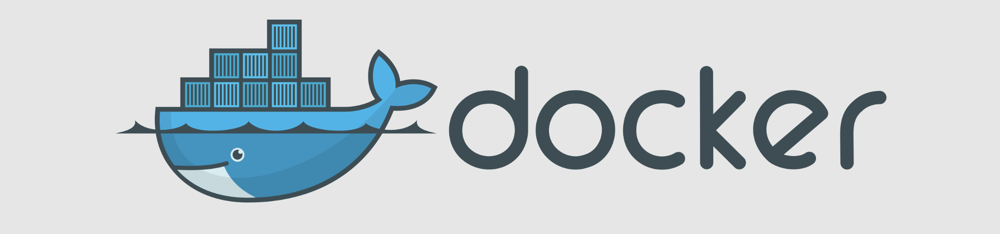

# Docker

> Problem Statement: the same piece of code runs fine on my laptop but fails on yours. Sound familiar?

`Docker` is the solution to that problem. Simple, right? Well, mostly. There's more to Docker than just that one line, and this guide walks you through it the practical way: by building, running, and breaking things yourself, not by memorizing theory.

If you're new to Docker, you're in the right place. This is a beginner-friendly guide focused on hands-on usage, not abstract concepts you'll forget by tomorrow. Every file uses one real Node.js application that we build, run, share, and improve as we go, so nothing you read feels disconnected from the last file.

## Table of Contents

| # | File | What you'll learn |
| --- | --- | --- |
| 1 | [Intro](concepts/1.%20Intro.md) | What Docker is, why it exists, and how it compares to Virtual Machines |
| 2 | [Image](concepts/2.%20Image.md) | What a Docker image is, writing a Dockerfile, and building your first image |
| 3 | [Container](concepts/3.%20Container.md) | What a container actually is, running it, and detached mode |
| 4 | [Registry](concepts/4.%20Registry.md) | Sharing images via Docker Hub, and versioning with tags |
| 5 | [Commands](concepts/5.%20Commands.md) | A cheat sheet of the Docker commands you'll use every day |
| 6 | [Port](concepts/6.%20Port.md) | What those two numbers in `-p 3000:3000` actually mean |
| 7 | [Volume](concepts/7.%20Volume.md) | Persisting data with Volumes and Bind Mounts |

## Hands-on project

All the examples in this guide use a single, simple Node.js app you can find at [`handson/simple-nodejs-application`](handson/simple-nodejs-application). Feel free to clone this repo and follow along with the exact same commands.

### Contributing

- If you find a typo, bug, have a suggestion or new topic to add, please submit a pull request. All contributions are welcome!

### Credits

- [Simply Byte](https://www.youtube.com/@SimplyByte)

 

> **`⭐️` Star this repository if you found it useful.**
