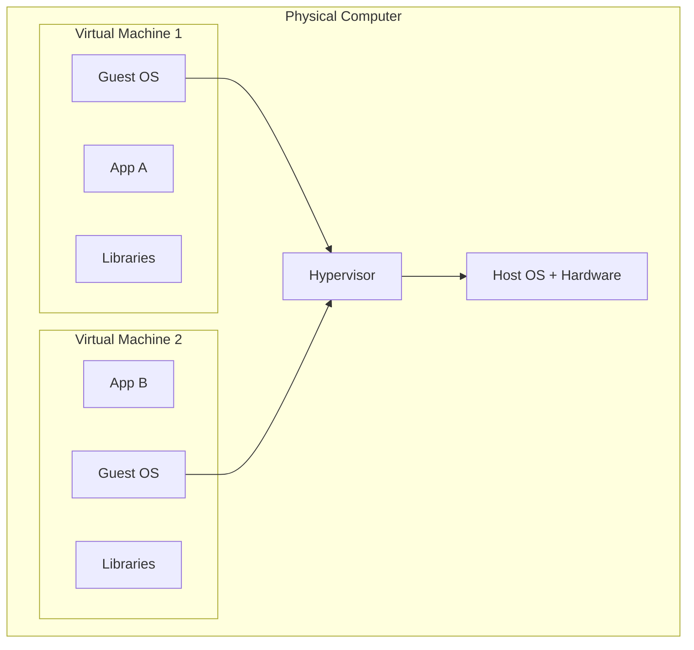
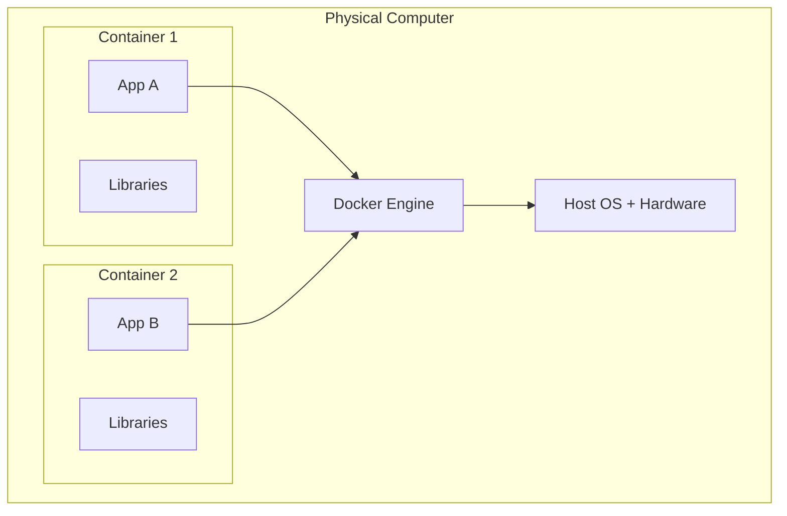

# Introduction to Docker

By the end of this file, you'll understand what Docker actually is, why it exists, and how it's different from a Virtual Machine. No installations yet, just the mental model. Once that's solid, everything else in this series will click much faster.

## The problem we're solving

Here's a scene every developer has lived through.

You write some code. It runs perfectly on your laptop. You push it, your teammate pulls it, and it breaks on their machine. Or worse, it works fine in your local setup but crashes the moment it hits the server.

Why does this happen? Usually it comes down to small differences that seem irrelevant until they aren't:

- A different version of Node.js or Python installed
- A missing environment variable
- An OS-level library that exists on your machine but not theirs
- A config file that got left out during setup

So basically, "works on my machine" isn't a joke, it's a real, recurring, expensive problem. Docker exists to solve exactly this.

## So, what is Docker?

Docker is an open source platform that packages an application together with everything it needs to run (code, runtime, libraries, system tools, settings) into a single unit called a **container**.

That container behaves the same way no matter where you run it: your laptop, your teammate's laptop, a testing server, or production. Same environment, every single time.

This packaging technique is called **containerization**, and it's the core idea behind Docker. Docker also gives you tools to automate how these containers get deployed, scaled, and managed, but we'll get to that gradually through this series.

Here's the thing though: to really understand why this is such a big deal, it helps to compare it against the older way of solving this same problem, Virtual Machines.

## Virtual Machines: the old way

A Virtual Machine (VM) is like creating an entirely separate computer inside your computer. It has its own CPU allocation, RAM, storage, and a full Operating System of its own.

Tools like VMware, VirtualBox, or Hyper-V are used to create and manage these VMs.

What do you think happens if you want to run 5 applications, each needing an isolated environment, using VMs? You'd need 5 full guest Operating Systems running side by side. Each one eats up CPU, RAM, and storage, even before your actual application starts doing any work.

That's heavy. VMs are powerful and still have their use cases (like running a completely different OS), but they're slow to start and expensive on resources.

## Where Docker containers are different

Docker containers skip the "install a whole new OS" part entirely. Instead of virtualizing the entire hardware and OS, containers share the host machine's OS kernel and only package what the application actually needs on top of it.

Not bad, right? No repeated guest Operating Systems, no wasted resources. This is exactly why containers start up in seconds while VMs can take minutes, and why you can comfortably run many more containers than VMs on the same hardware.

| | Virtual Machine | Docker Container |
| --- | --- | --- |
| Includes a full OS | Yes, one per VM | No, shares the host OS kernel |
| Startup time | Minutes | Seconds |
| Resource usage | Heavy | Lightweight |
| Isolation level | Very strong (separate OS) | Strong (isolated process, shared kernel) |
| Best for | Running different OS types, strong isolation needs | Packaging and shipping applications consistently |

## Recap

- The "works on my machine" problem happens because environments differ across machines.
- Docker solves this by packaging an app with everything it needs into a single unit called a container.
- VMs solve isolation by virtualizing an entire computer, including its own OS, which is heavy.
- Docker containers are lighter because they share the host OS kernel instead of bundling a full one.

## What's next

Now that you know why Docker exists, it's time to get your hands dirty. In the next file, we'll break down what a Docker **image** actually is, and build our very own image from scratch using a real Node.js application.
