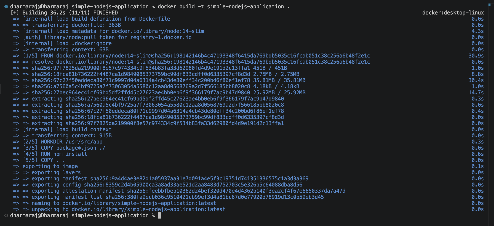
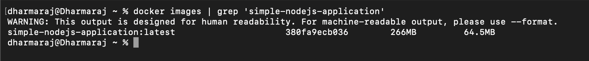
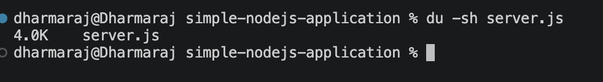
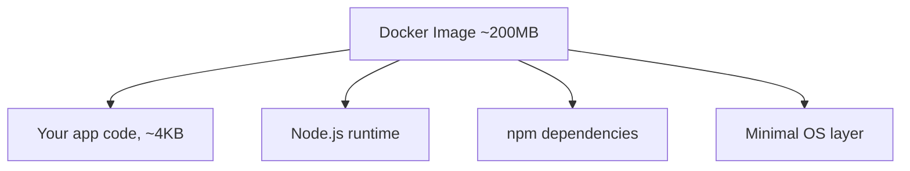

# Docker Image


You've probably heard the word "image" thrown around a lot in the Docker world. In this file, we'll break down exactly what it is, understand the Dockerfile that creates it, actually build one using a real Node.js app, and figure out why a tiny 4KB file somehow turns into a 200MB image.

## So, what is a Docker image?

Think of a Docker image as a snapshot that contains everything your application needs to run: the code, the runtime, the libraries, and even a minimal operating system layer underneath.

Here's an analogy depending on what you already know:

| If you know... | Think of an image like... |
| --- | --- |
| Java | A `jar` file, it bundles everything the app needs to run |
| Node.js | The `node_modules` folder, except way more complete |
| Python | A `venv` folder that's fully self contained |

The difference is, a Docker image goes even further than these. It doesn't just bundle your dependencies, it bundles a mini environment capable of running your app anywhere, regardless of what's installed on the host machine.

## The Dockerfile: instructions to build the image

So how do you actually create an image? You don't build it by hand. You write a set of instructions in a file called a `Dockerfile`, and Docker follows those instructions to build the image for you.

Let's look at the actual [Dockerfile](../handson/simple-nodejs-application/Dockerfile) from our sample Node.js app:

```dockerfile
# Download node.js
FROM node:14-slim

# Create app directory and change working directory
WORKDIR /usr/src/app

# Copy dependencies files
COPY package*.json ./

# Install dependencies
RUN npm install

# Bundle app source
COPY . .

# Configure the port the app runs on
EXPOSE 8080

# Start the app
CMD [ "node", "server.js" ]
```

Let's actually build one and walk through what each line means as we go, using this sample app that just returns a greeting message when you hit it.

| Instruction | What it does |
| --- | --- |
| `FROM node:14-slim` | Start from a base image that already has Node.js 14 installed (slim means a smaller, stripped-down version) |
| `WORKDIR /usr/src/app` | Create this folder inside the image and treat it as the working directory (basically `mkdir` + `cd`) |
| `COPY package*.json ./` | Copy `package.json` (and `package-lock.json` if it exists) into the image |
| `RUN npm install` | Install all the dependencies listed in `package.json` |
| `COPY . .` | Copy the rest of the application code into the image |
| `EXPOSE 8080` | Documents which port the app is expected to run on (we'll cover this properly in the Port file) |
| `CMD [ "node", "server.js" ]` | The command that runs when a container is started from this image |

In short, this Dockerfile is saying: "To run this app, install Node.js, grab the package.json, run npm install, copy the rest of the code, and then start the server." That's the blueprint, nothing more mysterious than that.

## Building the image

Ok, now what? Let's actually build it. Navigate to the folder where the Dockerfile lives and run:

```bash
docker build -t simple-nodejs-application .
```

- `-t simple-nodejs-application` tags (names) the image so you can refer to it later.
- The `.` at the end tells Docker "look for the Dockerfile in the current directory."

As soon as you hit enter, Docker starts executing each instruction in order and builds the image layer by layer.



## Where does the image go?

Once it's built, the image gets stored in your **local Docker registry** (basically Docker's local storage on your machine). You can check what's there by running:

```bash
docker images
```



## Wait, why is the image 200MB?

Here's something that might surprise you. Our entire application is just one file, [server.js](../handson/simple-nodejs-application/server.js), which weighs a tiny 4KB.



So why does the resulting image balloon to around 200MB? Let's actually think this through.

Node.js itself is not magic, it's an executable that needs low-level system libraries, a network stack, and a file system to actually function. Your host machine already has these because it runs a full OS. But a container doesn't automatically get any of that for free, it needs its own copy bundled in.

So when Docker builds the image from `node:14-slim`, it's bundling:

- The application code (your 4KB file)
- The Node.js runtime
- All the npm dependencies
- A minimal Linux-based OS layer to support all of the above



That's the trade-off you're making: a bigger image size in exchange for "guaranteed to run the exact same way, anywhere." That's a genuinely good deal for most real-world applications, and there are ways to shrink image size later (smaller base images, multi-stage builds), which we'll touch on in a future file once you're comfortable with the basics.

## Recap

- A Docker image is a snapshot containing your app, its runtime, dependencies, and a minimal OS layer.
- A Dockerfile is the set of instructions used to build that image.
- `docker build -t <name> .` builds the image from the Dockerfile in the current folder.
- `docker images` lists everything sitting in your local Docker registry.
- Images are bigger than your raw source code because they bundle the runtime and a mini OS, not just your files.

## What's next

We've built an image, but an image by itself doesn't do anything, it's just sitting there. In the next file, we'll actually run it and meet the thing that does the real work: the **container**.
