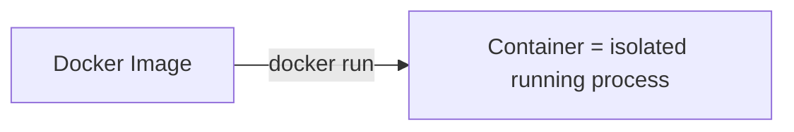
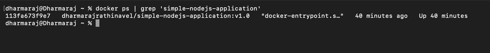
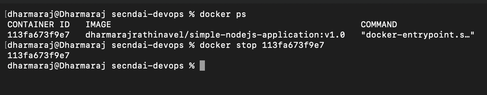
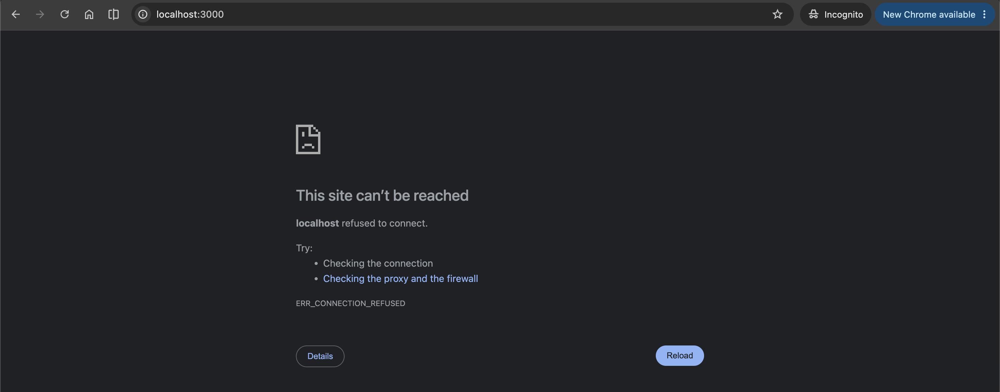

# Container


We built an image in the last file, but an image sitting in your local registry doesn't do anything on its own. In this file, we'll actually run it, understand what a container really is under the hood, and learn how to start, check, and stop one.

## So, what is a container, really?

Here's the simplest way to think about it: a container is just **a process running on your system**. That's genuinely it. Nothing more magical than that.

Think about what happens normally when you open an app like Chrome. It runs as a process on your machine. You can verify this yourself:

```bash
ps -ef | grep chrome
```

That command lists every Chrome process currently running. A Docker container works the same way, except it's an isolated process. It gets its own file system, its own network namespace, and its own little process tree, separate from everything else running on your machine.



## Image vs Container: what's the actual difference?

This trips up a lot of beginners, so let's make it crystal clear with a table.

| | Image | Container |
| --- | --- | --- |
| What it is | A blueprint / snapshot | A running instance of that blueprint |
| State | Static, doesn't change | Running (or stopped), has live state |
| Can you have multiple? | One image | Yes, many containers from the same image |
| Analogy | A class in programming | An object created from that class |

So basically, you build one image, and from that single image, you can spin up as many containers as you want, each one an isolated running instance.

## Running a container

Let's actually run one from the image we built earlier:

```bash
docker run -d -p 3000:3000 simple-nodejs-application
```

We'll dig deep into the `-p` flag in the Port file coming up next, but for now, let's talk about the `-d` flag, since it's important to understand right away.

## Detached mode (`-d`)

The `-d` flag stands for **detached mode**. It means the container runs quietly in the background, and you don't see its logs streaming in your terminal. Your terminal stays free for you to run other commands.

If you skip `-d`, the container runs in the foreground and your terminal gets "taken over" by its logs until you stop it.

## Checking what's running

What do you think happens if you forget which containers are currently running? Run this:

```bash
docker ps
```



This shows you every container currently active on your system, along with its container ID, the image it came from, and the ports it's using.

## Stopping a container

To stop a running container, grab its container ID from `docker ps` and run:

```bash
docker stop <container_id>
```

Once stopped, the process is gone and the application is no longer reachable.





Try hitting the app's URL in your browser after stopping it. You'll get a "site not reachable" error, because there's no process listening anymore. Makes sense, right? The container was the process, and it's not there anymore.

## Recap

- A container is simply an isolated process running on your machine.
- An image is the static blueprint, a container is a live, running instance of it.
- You can create many containers from the same single image.
- `-d` runs the container in detached mode, in the background.
- `docker ps` lists running containers, and `docker stop <container_id>` stops one.

## What's next

So far, we've only used images we built ourselves, stored locally. But what if you want to share your application with a friend, or a teammate, without them needing to install any dependencies at all? That's exactly what we'll cover next: the **Docker Registry** and image **Tags**.
