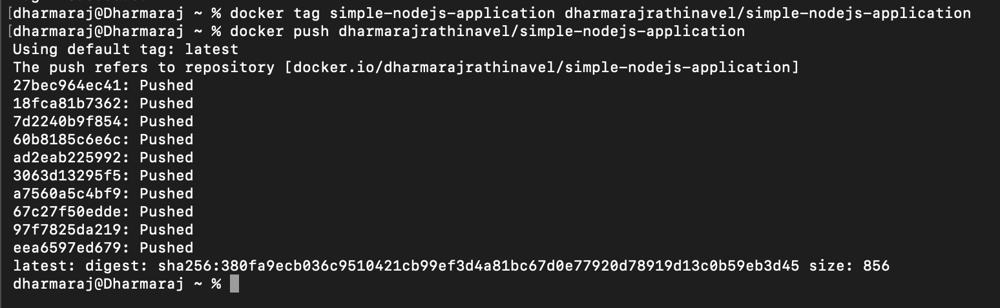
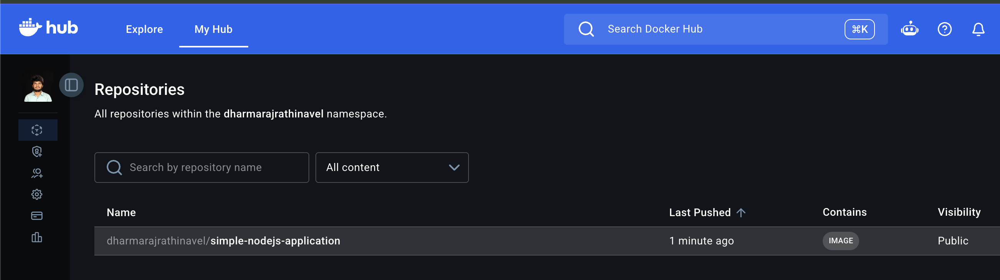
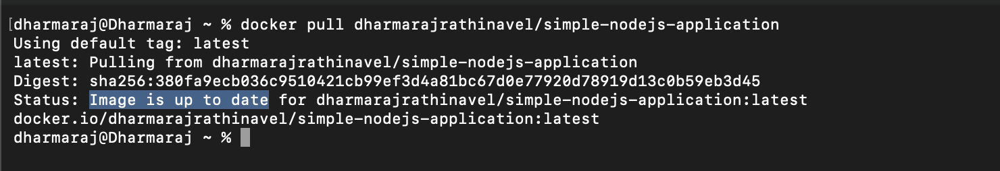
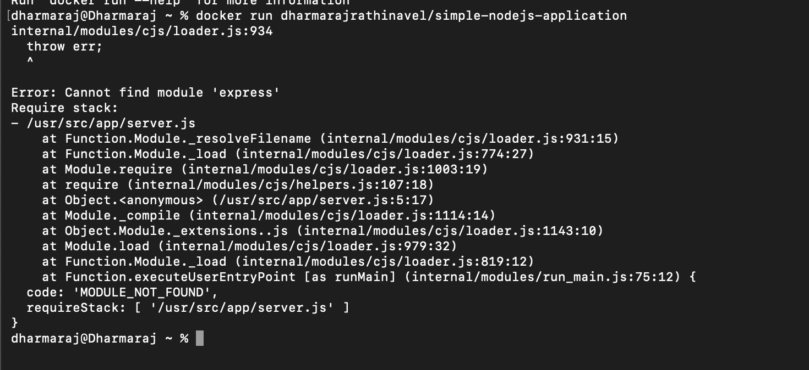
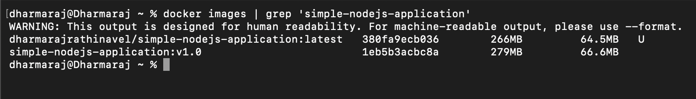
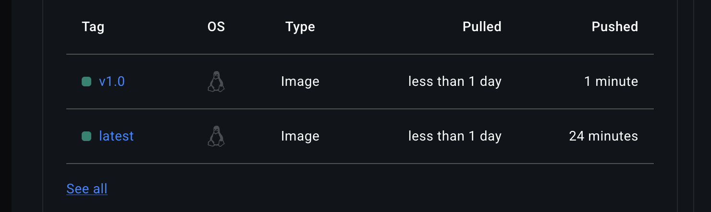
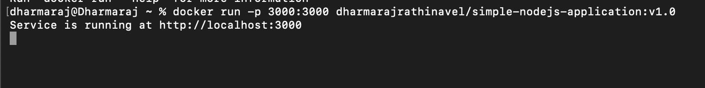
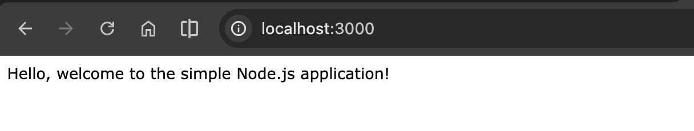

# Docker Registry and Tags


Right now, your image only exists on your own machine. In this file, we'll push it to a public registry so anyone can pull and run it, and then learn how tags let you manage multiple versions of the same image safely.

## The problem: your image only lives locally

You built an image in an earlier file, and it's sitting happily in your local Docker registry. But what if you want to share this application with a friend, or a teammate on your team, without making them install Node.js, run `npm install`, and configure everything by hand?

This is where a **Docker Registry** comes in.

## What is a Docker Registry?

Think of a Docker registry like GitHub, but for images instead of source code. It's a place where you store your Docker images so others can pull and run them, no setup required.

Just like GitHub, registries can be public or private. The most popular public one is **Docker Hub**.

## Pushing your image to Docker Hub

Here's how you'd actually do it:

1. Head to [Docker Hub](https://hub.docker.com/) and create a free account.
2. Come back to your terminal and log in from the CLI:

    ```bash
    docker login
    ```

3. Tag your local image with your Docker Hub username, then push it:

    ```bash
    docker tag simple-nodejs-application dharmarajrathinavel/simple-nodejs-application
    docker push dharmarajrathinavel/simple-nodejs-application
    ```

<div style="display: flex; flex-direction: row; gap: 10px;">
    
    
</div>

Now think about it from your friend's side. What do they need to do to run your entire application? Just one command:

```bash
docker pull dharmarajrathinavel/simple-nodejs-application
```



Not bad, right? Instead of sharing raw source code and asking your friend to install a dozen dependencies by hand, you're handing over the entire ready-to-run application.

## Why this matters more than it seems

Imagine building something like an e-commerce app, with dozens of dependencies, environment configs, and version requirements. If you shared just the source code, your friend would need to manually match every single one of those before the app even starts.

With Docker, none of that matters. They just pull the image and run it. It behaves exactly the way it does on your machine, because it *is* your machine's environment, packaged up.

> Life made a lot easier with Docker.

## What happens without a tag

Here's an experiment. The [package.json](../handson/simple-nodejs-application/package.json) in our sample app was missing the `express` dependency on purpose. So when we ran the app, it failed:



After adding `express` back into `package.json`, we need to rebuild. But here's the important question: what happens to the old, broken image if we rebuild without specifying a tag?

| Without a tag | With a tag |
| --- | --- |
| `docker build -t simple-nodejs-application .` | `docker build -t simple-nodejs-application:v1.0 .` |
| Replaces the existing image entirely | Creates a brand new, separate image tagged `v1.0` |
| The previous version is lost | The previous version is retained |

So basically, if you don't tag your builds, you lose your version history every single time you rebuild. That's risky, especially once real users depend on your app.

## Using tags properly

Let's rebuild with an explicit tag this time:

```bash
docker build -t simple-nodejs-application:v1.0 .
```

Now check your local images. You'll see two separate entries with the same name but different tags:



Push this tagged version to Docker Hub so your friend can pull that exact version:

```bash
docker tag simple-nodejs-application:v1.0 dharmarajrathinavel/simple-nodejs-application:v1.0
docker push dharmarajrathinavel/simple-nodejs-application:v1.0
```



To pull and run this specific tagged version fresh:

```bash
docker rmi simple-nodejs-application:v1.0
docker pull dharmarajrathinavel/simple-nodejs-application:v1.0
docker run -d -p 3000:3000 dharmarajrathinavel/simple-nodejs-application:v1.0
```

<div style="display: flex; flex-direction: row; align-items: flex-start; gap: 10px;">
    
    
</div>

That's it. Your friend just ran two commands, `docker pull` and `docker run`, and the whole application is up and running, no manual dependency installation involved.

## Why this matters: rollback safety

Since we tagged our previous working version, it's still sitting safely in the registry. What do you think happens if this new `v1.0` version has a bug in production? You can roll back instantly to the previous tag, instead of scrambling to fix things live.

This is the real power of tags: you get multiple independent, retrievable versions of the same application, and you're never one bad build away from losing a working version.

## Recap

- A Docker Registry (like Docker Hub) is where you store and share images, similar to GitHub for code.
- `docker login`, `docker tag`, and `docker push` get your image up to a registry.
- `docker pull` lets anyone grab and run your image without installing dependencies manually.
- Without tags, rebuilding an image overwrites the old one and you lose that version.
- Tags let you keep multiple versions around and roll back safely if something breaks.

## What's next

We've now covered images, containers, and registries with a bunch of commands along the way. In the next file, we'll pull all these Docker commands together into one clean reference table you can bookmark and come back to.
