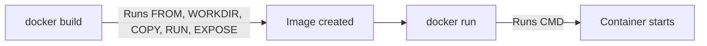

# Docker Commands


We've already used a bunch of Docker commands across the previous files. Here's the thing, it's easy to forget the exact syntax when you're just starting out. This file pulls everything together into one clean reference table you can bookmark and come back to whenever you need it.

## Before you start: prerequisites

You need two things installed to run Docker commands:

- **Docker Desktop**: the application that runs the Docker engine in the background
- **Docker CLI**: the command line tool you actually type commands into

Both come bundled together when you install Docker from the [official Docker website](https://www.docker.com/).

Once installed, verify everything is working by running:

```bash
docker --version
```

If you see a version number printed out, you're good to go.

## The commands you'll use most

| Command | What it does |
| --- | --- |
| `docker images` | Lists all images currently sitting in your local Docker registry |
| `docker build -t <image-name> .` | Builds an image from the Dockerfile in the current directory |
| `docker pull <image-name>` | Pulls (downloads) an image from a registry like Docker Hub |
| `docker run <image-name>` | Runs a new container from an image |
| `docker run -d <image-name>` | Runs a container in detached (background) mode |
| `docker run -p <host-port>:<container-port> <image-name>` | Maps a port on your machine to a port inside the container |
| `docker ps` | Lists currently running containers |
| `docker stop <container-id>` | Stops a running container |
| `docker rmi <image-name>` | Removes an image from your local registry |
| `docker tag <image> <new-tag>` | Creates a new tag pointing to an existing image |
| `docker push <image-name>` | Pushes an image to a registry like Docker Hub |
| `docker login` | Logs you into Docker Hub (or another registry) from the CLI |

## The Dockerfile instructions you'll use most

These aren't CLI commands, they go inside your `Dockerfile` and get executed when you run `docker build`.

| Instruction | What it does |
| --- | --- |
| `FROM` | Specifies the base image to start from |
| `WORKDIR` | Sets the working directory inside the image (like `mkdir` + `cd` combined) |
| `COPY` | Copies files from your machine into the image |
| `RUN` | Executes a command while the image is being built (like `npm install`) |
| `EXPOSE` | Documents which port the app inside the container listens on (optional, doesn't actually publish the port) |
| `CMD` | The command that runs when a container starts from this image |

## An important gotcha: build time vs run time

This one trips up a lot of beginners, so pay close attention here.

- `FROM`, `WORKDIR`, `COPY`, `RUN`, and `EXPOSE` all execute when you run `docker build`. They shape what goes *into* the image.
- `CMD` does **not** run during `docker build`. It only runs later, when you actually start a container with `docker run`.



So basically, building an image just prepares everything and packages it up. Nothing inside your app actually "starts running" until you run a container from that image.

## Recap

- `docker build`, `docker run`, `docker ps`, and `docker stop` cover the everyday container lifecycle.
- `docker images`, `docker tag`, `docker push`, and `docker pull` cover sharing and versioning images.
- Dockerfile instructions like `FROM`, `COPY`, and `RUN` execute at build time. `CMD` only executes at run time.

## What's next

We've briefly touched the `-p` flag in earlier files without fully explaining it. In the next file, we're going to dig deep into port mapping, and clear up exactly what those two numbers in `-p 3000:3000` actually mean.
