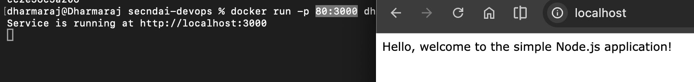
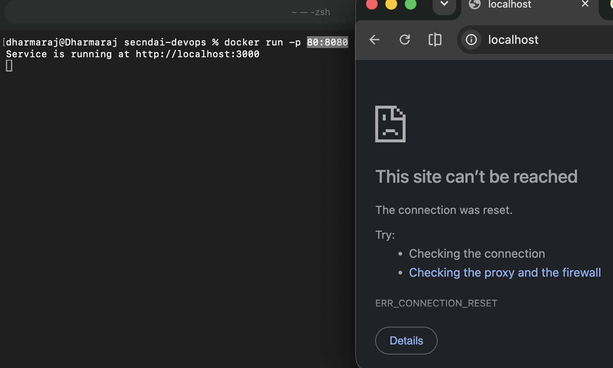
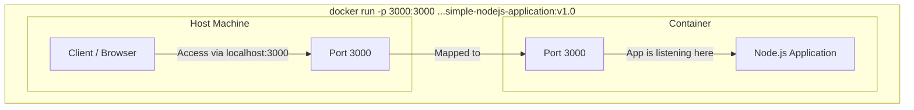

# Port


You've seen the `-p` flag a few times already when running containers. In this file, we'll actually break down what those two numbers mean, run a few experiments to prove it, and make sure you never get confused by port mapping again.

## Where we left off

We ran our app earlier using this command:

```bash
docker run -p 3000:3000 dharmarajrathinavel/simple-nodejs-application:v1.0
```

The `-p` flag maps a port on your host machine (your laptop) to a port inside the container. But here's a question: why are there two port numbers separated by a colon? Usually, a Node.js or Spring Boot app only listens on one port. So what's the second number doing here?

## Let's actually test it

What do you think happens if we run the app with `-p 80:3000`? Will we still be able to access it at `http://localhost:3000`?

Simply, **no**. Here's why: this command maps port `80` on your host machine to port `3000` inside the container. So the app becomes accessible at `http://localhost:80`, not `3000`. You can even drop the port number from the URL entirely, since `80` is the default port for HTTP.

**Takeaway**: the **first** port number in `-p` is the port on your **host machine**. That's the port your browser or any client will actually use to reach the app.

## What about the second number?

Let's try another experiment. What if we run `-p 80:3333`? Will it throw an error?

Surprisingly, **no**. Docker will happily run it, no complaints. So what's going on?

Let's check where the port numbers are actually defined in our app:

| File | Port number |
| --- | --- |
| [server.js](../handson/simple-nodejs-application/server.js) | 3000 |
| [Dockerfile](../handson/simple-nodejs-application/Dockerfile) | 8080 (via `EXPOSE`) |

**Takeaway**: the **second** port number in `-p` needs to match whatever port your application is actually *listening* on internally. Docker doesn't validate this for you, if it's wrong, the command still runs, but the app just won't be reachable.

## Proving it with two runs

**Run 1:** `-p 80:3000`

```bash
docker run -p 80:3000 dharmarajrathinavel/simple-nodejs-application:v1.0
```

This works, because `3000` matches what `server.js` is actually listening on.



**Run 2:** `-p 80:8080`

```bash
docker run -p 80:8080 dharmarajrathinavel/simple-nodejs-application:v1.0
```



Not accessible. Why? Even though the Dockerfile declares `EXPOSE 8080`, that's just documentation, it doesn't force the app to listen there. The app's actual code in `server.js` decides the real port, and that code says `3000`. So `EXPOSE 8080` in the Dockerfile ends up being misleading here, and the second number in `-p` needs to match the code, not the Dockerfile's `EXPOSE` line.

## Summing it up

| First port number | Second port number |
| --- | --- |
| Port on the host machine | Port inside the container |
| This is what clients use to access the app | This must match whatever port the app is actually listening on internally |



## Recap

- `-p <host-port>:<container-port>` is the format for port mapping.
- The first number is what you type in your browser, it lives on your host machine.
- The second number must match what your app actually listens on internally, not what `EXPOSE` says in the Dockerfile.
- `EXPOSE` in a Dockerfile is just documentation, it doesn't decide the real listening port on its own.

## What's next

So far, everything we've built disappears the moment we remove a container, including any logs or data it wrote. In the next file, we'll fix that using **Volumes** and **Bind Mounts**, so your data survives even after a container is gone.
