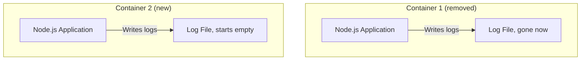
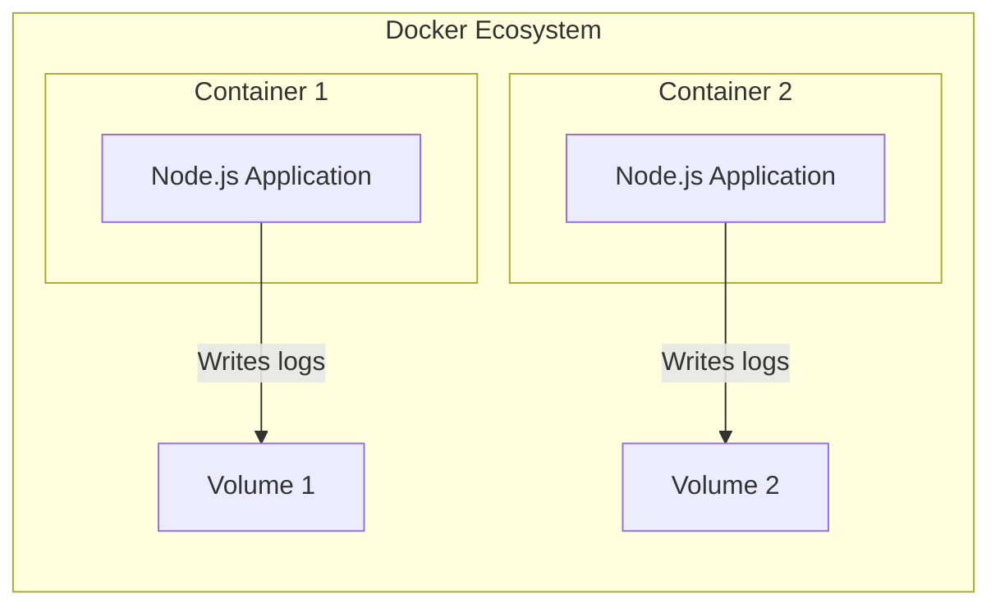
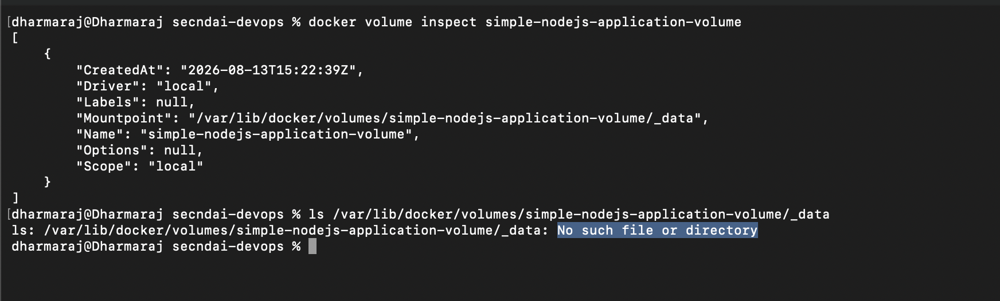
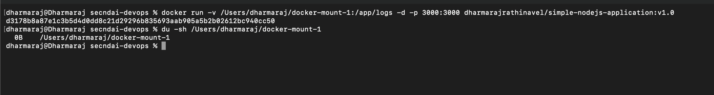

# Volume


By now you've built images, run containers, shared them through a registry, and mapped ports correctly. There's one problem left: containers forget everything the moment you remove them. In this file, we'll fix that using Volumes and Bind Mounts.

## The problem: containers are ephemeral

Say you're running a Node.js application in a container, and it's writing logs to a file inside that container. Now, if you stop and restart that same container, the logs are still there, no issue.

But what if you **remove** the container entirely and spin up a brand new one from the same image? Do you think you'll still see the old logs?

**No.** Here's why: the new container starts completely fresh. It has no idea the old one ever existed.



This happens because containers are **ephemeral** by nature, they're meant to be disposable. Anything written inside a container's own filesystem disappears the moment that container is removed. So we need a way to persist data independently of any single container's lifecycle. This is exactly what a **Volume** solves.

## Creating a Volume

Let's create one:

```bash
docker volume create <volume_name>
```

Verify it exists:

```bash
docker volume ls
```

Think of a volume as separate, persistent storage managed by Docker itself, living outside any individual container.



## Mounting a Volume to a container

One important rule here: you **cannot** attach a volume to a container that's already running. Volumes get mounted at the moment you create the container, not after.

```bash
docker run -v simple-nodejs-application-volume:/app/logs -d -p 3000:3000 dharmarajrathinavel/simple-nodejs-application:v1.0
```

Here, `-v simple-nodejs-application-volume:/app/logs` tells Docker: "take this volume, and mount it at `/app/logs` inside the container."

Once mounted, any logs written to `/app/logs` inside the container actually get written to the volume instead. So now, even if you remove this container completely, the logs survive in the volume. A brand new container can mount that same volume later and pick up right where the old one left off.

## The catch: volumes aren't directly browsable

Here's a real scenario. Say your DevOps team needs to inspect these logs directly. Can they just open a folder on the host machine and look? Not quite, volumes are managed by Docker internally, and you can't access them directly from the host filesystem in a simple, straightforward way.



So what's the alternative when you specifically want the files sitting somewhere you can browse directly? That's where **Bind Mounts** come in.

## Bind Mount

A bind mount works almost the same way as a volume mount, except instead of Docker managing the storage internally, the files get written directly to a folder you choose on your host machine.

So now, you (or your DevOps team) can open that folder normally and see the logs, no Docker commands required.

Just like volumes, a new container can mount the exact same host folder to continue accessing logs written by a previous container.

Here's how you'd set one up:

```bash
docker run -v /Users/dharmaraj/docker-mount-1:/app/logs -d -p 3000:3000 dharmarajrathinavel/simple-nodejs-application:v1.0
```



See that? The logs are now sitting right there in a normal folder on the host machine, fully browsable.

## Volume vs Bind Mount: when to use which

| | Volume | Bind Mount |
| --- | --- | --- |
| Managed by | Docker | You (a specific folder on the host) |
| Directly browsable on host | No | Yes |
| Best for | Production data Docker should manage | Local development, debugging, or when a team needs direct file access |

## Recap

- Containers are ephemeral, anything written to a container's own filesystem is lost once it's removed.
- A Volume is Docker-managed persistent storage that survives container removal.
- Volumes must be mounted at container creation time, not after it's already running.
- A Bind Mount works similarly but writes directly to a folder on your host machine, so you can browse the files yourself.

## Wrapping up the series

That's the core of Docker covered: images, containers, registries, tags, commands, ports, and now persistent storage with volumes and bind mounts. You've gone from "what even is Docker" to actually building, running, sharing, and persisting a real application.

The best next step from here? Take one of your own projects and containerize it yourself. That's genuinely the fastest way to make all of this stick.
